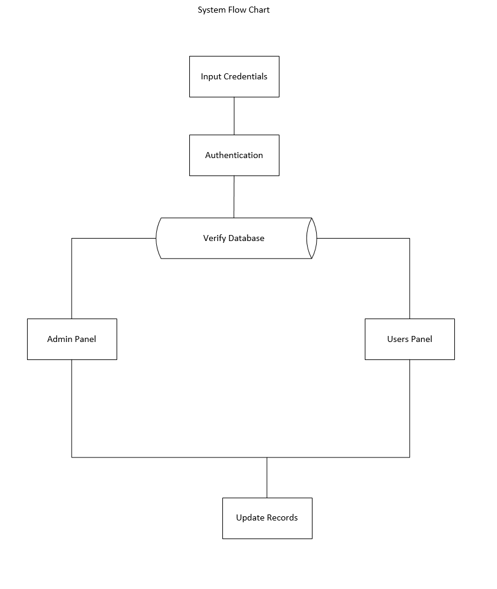
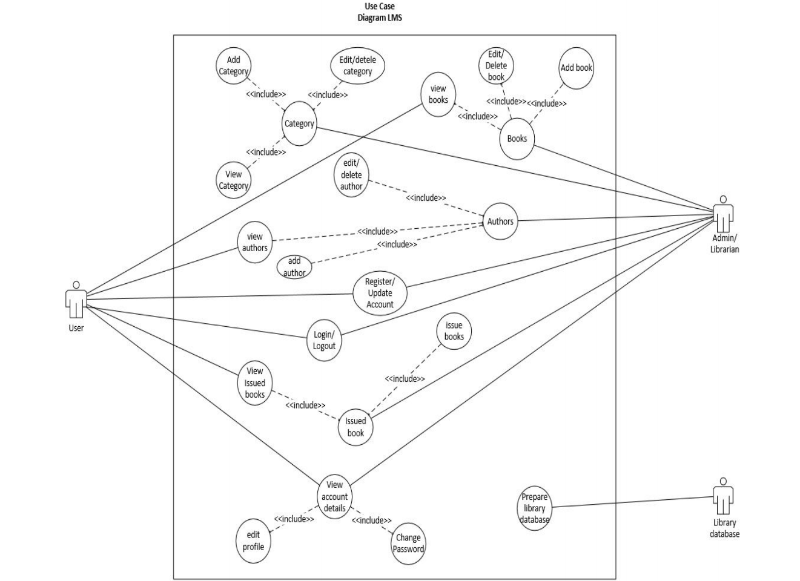
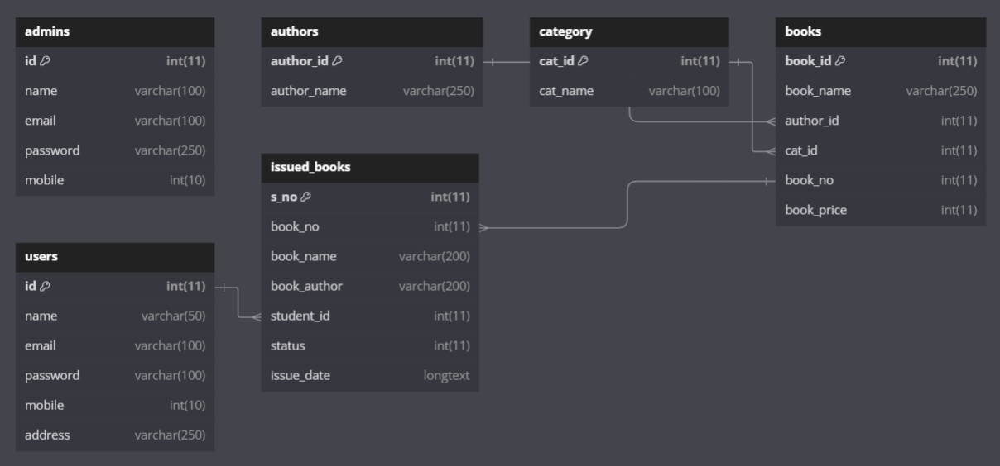
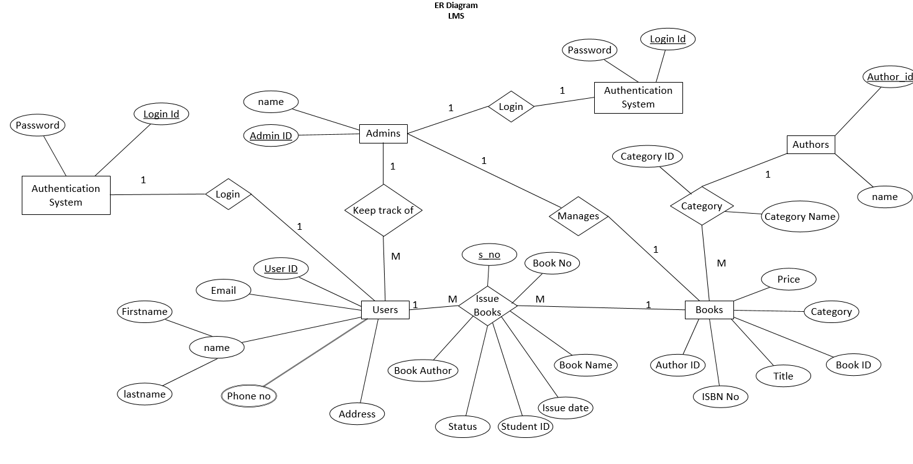
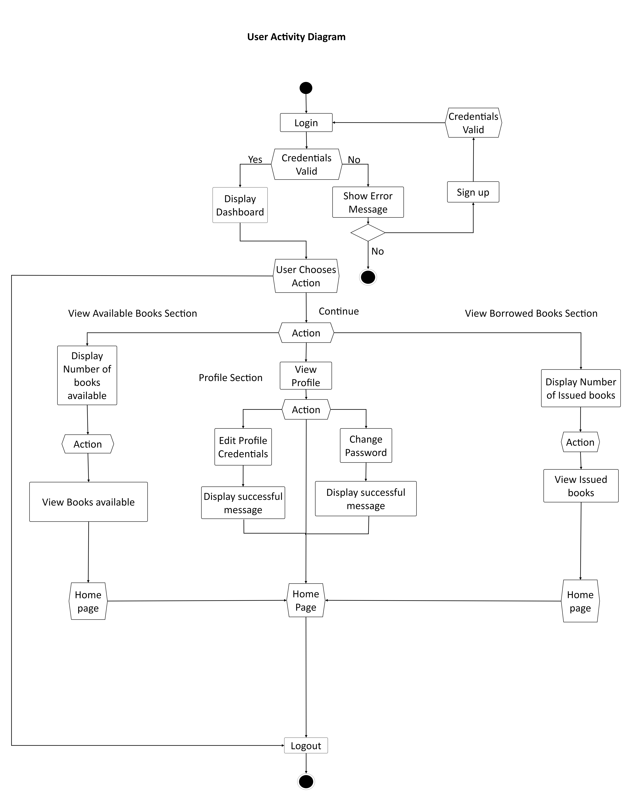

# Development-of-a-Comprehensive-Library-Management-System-based-on-bootstrap

# 📚 Library Management System (LMS)

Welcome to my **Library Management System** — a full-stack web app built to modernize outdated library processes using simple, accessible technology. This system was created with the goal of helping **Zambian librarians** replace pen-and-paper logs with a clean, responsive, and secure digital platform.

Built with PHP, MySQL, HTML, Bootstrap, and powered locally through XAMPP, this project was developed as part of my Computer Science degree at **Wuhan Institute of Technology** and supervised by **Lecturer Dawei Wen**.

---

## 🚀 What It Does

This system digitizes the day-to-day operations of a library:
- 💼 Admins can manage books, users, authors, categories, and issue/return transactions
- 👩‍🏫 Librarians get an overview of borrowed items and overdue returns
- 👨‍🎓 Users can log in, view available books, track their borrowing history, and update their profiles

Designed specifically for environments like **Zambia**, where access to paid software and reliable internet can be limited.

---

## 🧰 Tech Stack

- **Frontend:** HTML, CSS, Bootstrap
- **Backend:** PHP (code that runs behind the scenes)
- **Database:** MySQL (stores all the data like users, books, transactions)
- **Local Hosting:** XAMPP (runs the app on your own computer without needing the internet)

---

## 🔑 Core Features

### For Admins:
- 🔐 Login securely with admin access
- 📚 Add, edit, or delete books, authors, and categories
- 👥 View users and manage borrowing history
- 🔄 Issue and return books with clear status updates

### For Users:
- 🔍 Search and view books
- 👤 Manage your own profile and password
- 📖 See your personal borrow history

---

## 🧠 System Design & Planning

Before jumping into code, I started by mapping out **how the system should work from the user's perspective**, and how information would move behind the scenes. This helped me avoid confusion during development and made the whole system more reliable and easy to maintain.

### 👥 User Flow

There are two types of people using this system:
- **Admins** (like librarians): They can manage books, authors, and users.
- **Users** (like students or patrons): They can browse books and check their own borrowed items.

Here’s how the system flows:
1. Everyone starts at the **login page**
2. Based on their role, they’re taken to their personalized dashboard
3. **Admins** can issue or return books, manage book lists, and view users
4. **Users** can view available books, update their profile, and track their borrow history

### ✏️ How I Planned It Out

To make sure everything worked as expected, I used some common design diagrams — kind of like blueprints before building a house. Here's what they mean in simple terms:

- **User Flow Diagrams:** Helped map how users interact with each page
- **Database Map (ER Diagram):** Shows how books, users, authors, and borrowing records are connected
- **Navigation Charts:** Guided the setup of buttons, links, and page routing
- **Workflow Diagrams:** For example, how book issuance works from click to confirmation

### 🧩 Database Design (In Simple Terms)

The database is like a smart filing cabinet, organized to:
- Keep each book tied to a category and author
- Log all borrow and return activity
- Prevent duplicate entries
- Ensure each user is tied to their own borrowing history

---

## 🔐 Security + Data Integrity

- Inputs are validated both in the browser and on the server
- Passwords are encrypted (not stored in plain text)
- Role-based access prevents unauthorized users from viewing admin tools
- Books can’t be borrowed twice at the same time
- All data relationships are enforced using built-in database rules

---

## ✅ Testing & Validation

This system went through several layers of testing:

- 🧪 **Unit Testing** — Checked each feature like login, registration, and book issuance
- 🔗 **Integration Testing** — Ran through full user flows from login to book return
- 👥 **User Feedback** — Shared early versions with friends and librarians to make sure it made sense

**Tools Used:**
- Manual browser-based testing
- Simulated errors in phpMyAdmin
- Local testing using XAMPP

---

## 🐛 Common Errors & How I Fixed Them

**1. Login didn’t reset properly after logout**
- ✖️ Problem: Sessions weren’t clearing, so users stayed logged in
- ✅ Fix: Used `session_unset()` and `session_destroy()` to fully clear the login

**2. Admin-only pages were visible to users**
- ✖️ Problem: User roles weren’t checked correctly
- ✅ Fix: Added role checks and redirect rules in the login and dashboard code

**3. Forms didn’t show errors**
- ✖️ Problem: Users could leave fields empty and nothing would happen
- ✅ Fix: Added real-time JavaScript feedback + backend error messages

**4. Duplicate book issuing**
- ✖️ Problem: A user could borrow the same book multiple times
- ✅ Fix: Added a “status” column (issued/returned) and logic to prevent duplicates

**5. Broken page links**
- ✖️ Problem: Clicking “edit” or “view” sometimes went to the wrong place
- ✅ Fix: Cleaned up hardcoded links and added error handling for missing IDs


---

## 📈 Real-World Capacity & Use

This system was tested with real data to simulate a small library setup:

- 📚 **Books Stored:** Sample database includes 8 books for demonstration
- 📖 **Books Issued:** 6 borrow/return records for demonstration
- 👥 **Users:** 7+ registered users logged in and interacted with the system

The platform is designed to scale — from a handful of users to **thousands**, and from a few books to **tens of thousands**, depending on server capacity.

---

## 💻 How to Set Up This Project (Localhost)

### Prerequisites:
- [XAMPP](https://www.apachefriends.org/index.html)
- Web browser (like Chrome)
- Code editor (VS Code works great)

### Setup Steps:
1. Download and install XAMPP
2. Place the project folder inside `C:/xampp/htdocs/`
3. Start Apache and MySQL from the XAMPP Control Panel
4. Visit `http://localhost/phpmyadmin`
5. Import the database file `LMS database query.sql`
6. Go to `http://localhost/LMS` in your browser
7. Use:
   - **Email:** `admin@gmail.com`
   - **Password:** `admin@1234`

Done! You’re live on localhost 🎉

---

## 🧑‍💻 Author

👋 Hi, I’m **Alex Chirwa** – a Computer Science graduate passionate about networking, cybersecurity, and building tools that actually solve problems.

This project was built under the mentorship of **Lecturer Dawei Wen** at Wuhan Institute of Technology, with feedback from friends, developers, and librarians in Zambia.

---


## 📸 Screenshots

You can include your screenshots by placing them in your GitHub repository’s folder (e.g., `/screenshots`) and embedding them like this:

```markdown
### 📝 Data Flow Diagram


### 📝 Data Flow Diagram


### 📝 Operational Flow Chat


### 📝 System flow Chart


### 👩‍💻 Use case diagram


### 📖 Overall structure of the Library Management System


### 📋 schema design diagram of the library management system


### 🪢 Entity relationship Diagram


### 📖 Class diagram of the Library Management System


### 📋 Admin Activity Diagram


### 👩‍💻 User Activity Diagram


### 📖 Book List View


### 📋 Admin Dashboard


### 🔐 Login Page


### 📖 Book List View


### 📋 Admin Dashboard


### 🔐 Login Page


### 📖 Book List View


### 📋 Admin Dashboard


### 🔐 Login Page


### 📖 Book List View


### 📋 Admin Dashboard


### 🔐 Login Page


### 📖 Book List View


### 📋 Admin Dashboard


### 🔐 Login Page


### 📖 Book List View


### 📋 Admin Dashboard


### 🔐 Login Page


### 📖 Book List View


### 📋 Admin Dashboard


### 🔐 Login Page


### 📖 Book List View


## 📄 License

Open-source under the [MIT License](LICENSE). Feel free to use, fork, or build on it!

---

## 🙌 Thanks

Thanks to everyone who gave feedback during development. If this helped you or inspired something, drop a ⭐ on the repo and let’s connect!

